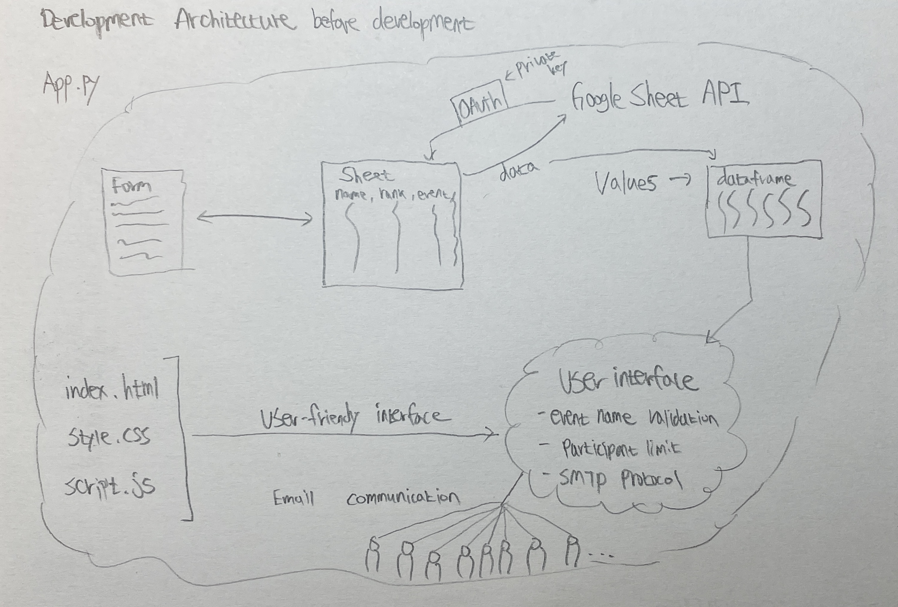
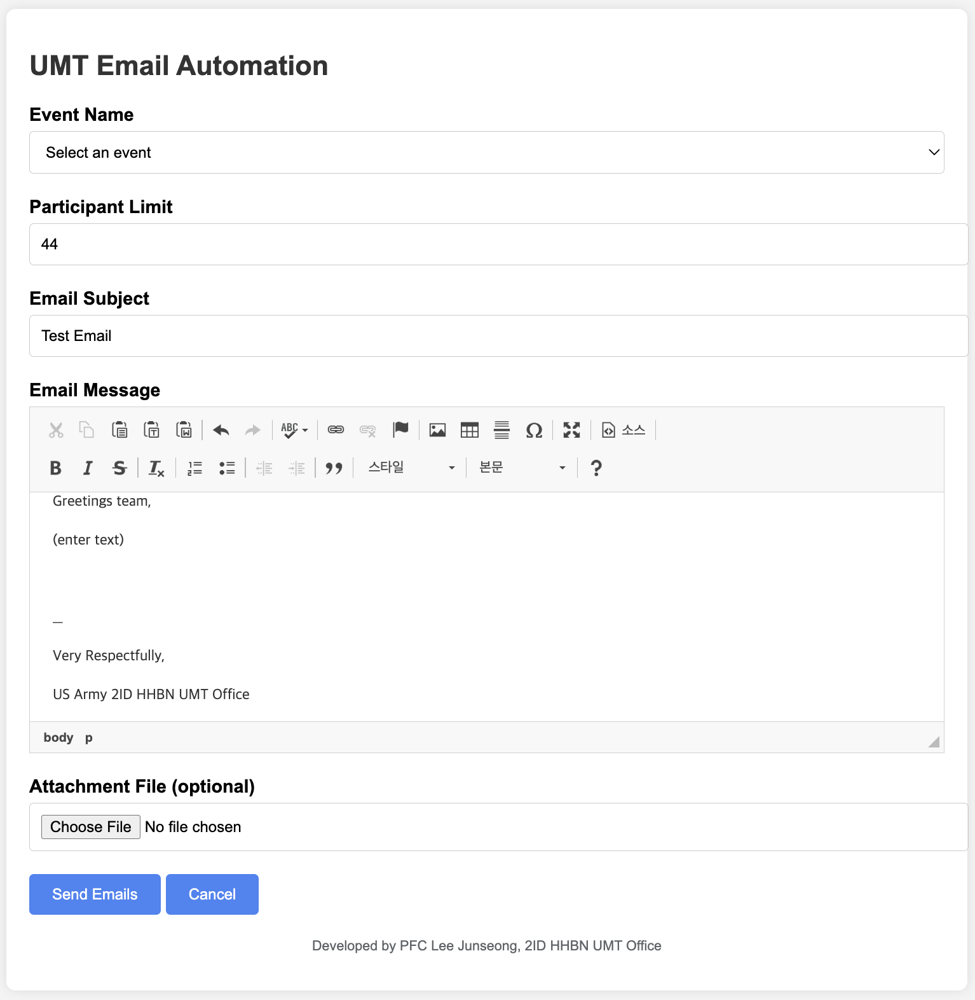

### Steps to Run:
1. Install dependencies: pip install -r requirements.txt
2. Set environment variables: Create a .env file with the necessary credentials.
3. Add service account credentials
4. Run the Flask app: python app.py
5. Access the web application at http://127.0.0.1:5000/
-----
# Project Summary: UMT Email Automation Web Application

## Overview
I developed a web application for the 2ID HHBN UMT Office to automate the process of sending mass emails to participants of various events. This project addresses the need for a more efficient system to manage event communications, ensuring timely and organized dissemination of information.

## Problem Statement
The manual process of hand-registering participants on paper roster and sending emails to event participants were time-consuming, prone to errors, and inefficient. Coordinating communications for large groups required significant effort and often led to delays. There was a clear need for a streamlined solution to improve the efficiency and timeliness of our communication processes.

## Solution
The UMT Email Automation Web Application is designed to automate the process of sending customized emails to event participants. It integrates with Google Sheets to fetch participant data, allows for easy email customization, and supports the inclusion of attachments. Key features include:

- **Google Sheets Integration**: Fetches participant data directly from a specified Google Sheet, ensuring up-to-date information.
- **Participant Limit Validation**: Ensures the number of participants does not exceed the specified limit by slicing the array of email address list.
- **Event Name Validation**: The event name is selected from the available options in the Google Sheet, and the participants are selected accordingly.
- **Email Customization**: Utilizes a WYSIWYG editor (CKEditor) to allow for rich text formatting, including bold, italics, and underline.
- **Attachment Support**: Provides the option to include flyers, pdf guides, or schedule in the emails.

## Benefits
- **Increased Efficiency**: Automating the email sending process significantly reduces the time and effort required to communicate with event participants.
- **Error Reduction**: Automated data fetching and validation reduce the likelihood of errors in email communication.
- **Timeliness**: Ensures timely dissemination of information, improving communication effectiveness.
- **User-Friendly Interface**: The intuitive web interface, complete with text formatting options and validation, enhances user experience.

## Technologies Used
- **Flask**: A lightweight web framework for Python, used to build the web application.
- **Google Sheets API**: To fetch participant data from Google Sheets.
- **CKEditor**: For rich text email customization.
- **HTML/CSS/JavaScript**: For building the user interface and handling client-side interactions.

## Conclusion
The UMT Email Automation Web Application has successfully addressed the inefficiencies in our email communication process, enabling more organized and timely event coordination.
